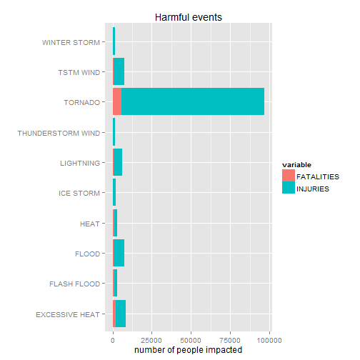
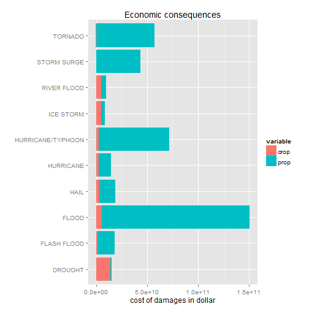

##Synopsis
- This project involves exploring the U.S. National Oceanic and Atmospheric Administration's (**NOAA**) storm database.
- This database tracks characteristics of major storms and weather events in the United States, including when and where they occur, as well as estimates of any fatalities, injuries, and property damage.
- The events in the database start in the year 1950 and end in November 2011.
- In the earlier years of the database there are generally fewer events recorded, most likely due to a lack of good records. 
- More recent years should be considered more complete.


#Data Processing
loading dataset in R

```r
storm = read.csv("repdata-data-StormData.csv")
```

How the data are processed for analysis (i.e **tidy data**)

```r
df = storm[c("EVTYPE","FATALITIES" ,"INJURIES","PROPDMG", "PROPDMGEXP" ,"CROPDMG"  ,  "CROPDMGEXP" )]
df$PROPDMGEXP = as.character(df$PROPDMGEXP)
df$CROPDMGEXP = as.character(df$CROPDMGEXP)
df$PROPDMGEXP[df$PROPDMGEXP=="0"] = 1
df$PROPDMGEXP[df$PROPDMGEXP==""] = 0
df$PROPDMGEXP[df$PROPDMGEXP=="-"] = 0
df$PROPDMGEXP[df$PROPDMGEXP=="+"] = 0
df$PROPDMGEXP[df$PROPDMGEXP=="?"] = 0
df$PROPDMGEXP[df$PROPDMGEXP=="1"] = 10
df$PROPDMGEXP[df$PROPDMGEXP=="2"] = 100
df$PROPDMGEXP[df$PROPDMGEXP=="3"] = 1000
df$PROPDMGEXP[df$PROPDMGEXP=="4"] = 10000
df$PROPDMGEXP[df$PROPDMGEXP=="5"] = 100000
df$PROPDMGEXP[df$PROPDMGEXP=="6"] = 1000000
df$PROPDMGEXP[df$PROPDMGEXP=="7"] = 10000000
df$PROPDMGEXP[df$PROPDMGEXP=="8"] = 100000000
df$PROPDMGEXP[df$PROPDMGEXP=="H"] = 100
df$PROPDMGEXP[df$PROPDMGEXP=="h"] = 100
df$PROPDMGEXP[df$PROPDMGEXP=="K"] = 1000
df$PROPDMGEXP[df$PROPDMGEXP=="B"] = 1000000000
df$PROPDMGEXP[df$PROPDMGEXP=="m"] = 1000000
df$PROPDMGEXP[df$PROPDMGEXP=="M"] = 1000000

df$CROPDMGEXP[df$CROPDMGEXP=="0"] = 1
df$CROPDMGEXP[df$CROPDMGEXP==""] = 0
df$CROPDMGEXP[df$CROPDMGEXP=="?"] = 0
df$CROPDMGEXP[df$CROPDMGEXP=="2"] = 100
df$CROPDMGEXP[df$CROPDMGEXP=="k"] = 1000
df$CROPDMGEXP[df$CROPDMGEXP=="K"] = 1000
df$CROPDMGEXP[df$CROPDMGEXP=="m"] = 1000000
df$CROPDMGEXP[df$CROPDMGEXP=="M"] = 1000000
df$CROPDMGEXP[df$CROPDMGEXP=="B"] = 1000000000

df$PROPDMGEXP = as.numeric(df$PROPDMGEXP)
df$CROPDMGEXP = as.numeric(df$CROPDMGEXP)

df$crop = df$CROPDMG * df$CROPDMGEXP
df$prop = df$PROPDMG * df$PROPDMGEXP

# to get the whole effect on population health we just sum up both fatalities and injuries
df$fisum = rowSums(df[,2:3])

# to get the whole effect on economic consequences we just sum up both property and crop damages
df$pcsum = rowSums(df[,8:9])
head(df)
```

```
##    EVTYPE FATALITIES INJURIES PROPDMG PROPDMGEXP CROPDMG CROPDMGEXP crop
## 1 TORNADO          0       15    25.0       1000       0          0    0
## 2 TORNADO          0        0     2.5       1000       0          0    0
## 3 TORNADO          0        2    25.0       1000       0          0    0
## 4 TORNADO          0        2     2.5       1000       0          0    0
## 5 TORNADO          0        2     2.5       1000       0          0    0
## 6 TORNADO          0        6     2.5       1000       0          0    0
##    prop fisum pcsum
## 1 25000    15 25000
## 2  2500     0  2500
## 3 25000     2 25000
## 4  2500     2  2500
## 5  2500     2  2500
## 6  2500     6  2500
```

#Results
####Top 10 events that are most harmful with respect to population health


```r
t = tapply(df$fisum, df$EVTYPE, sum)
f = tapply(df$FATALITIES, df$EVTYPE, sum)
i = tapply(df$INJURIES, df$EVTYPE, sum)
d = data.frame(sum =t, EVTYPE=as.character(rownames(t)), FATALITIES = f, INJURIES = i)
d= d[order(d$sum, decreasing = T),]

# to convert wide data format into long format just to make stacks into bar plot

library(reshape2)
library(ggplot2)
m = melt(d, id.vars = c("EVTYPE", "sum"))
m = m[order(m$sum, decreasing = T),]
ggplot(head(m,20), aes(y=value, x=EVTYPE, fill=variable)) + geom_bar(stat = "identity") + coord_flip() + labs(x = "", y="number of people impacted")+ ggtitle("Harmful events")
```

 

####Top 10 events that have the greatest economic consequences

```r
t1 = tapply(df$pcsum, df$EVTYPE, sum)
cr = tapply(df$crop, df$EVTYPE, sum)
pr = tapply(df$prop, df$EVTYPE, sum)
d1= data.frame(sum=t1, EVTYPE=as.character(rownames(t)), crop = cr, prop= pr)
d1 = d1[order(d1$sum, decreasing = T),]

library(reshape2)
library(ggplot2)
m1 = melt(d1, id.vars = c("EVTYPE", "sum"))
m1 = m1[order(m1$sum, decreasing = T),]
ggplot(head(m1,20), aes(y=value, x=EVTYPE, fill=variable)) + geom_bar(stat = "identity") + coord_flip() + labs(x = "", y="cost of damages in dollar")+ ggtitle("Economic consequences")
```

 


